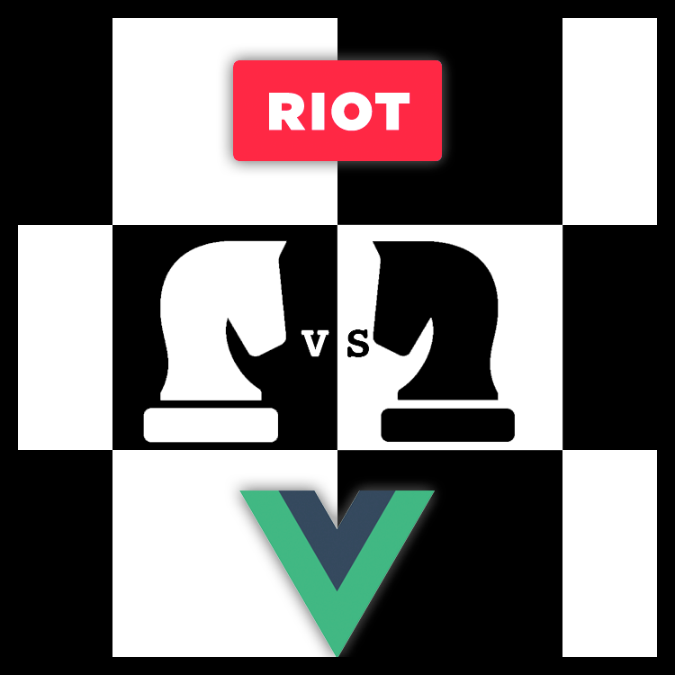

# Riot vs Vue



A side by side comparison with examples.

---

For an "fair and balanced" comparison, lets see what everyone else is saying about the subject, and then we'll get down to real experiments.

###### Articles:
- https://medium.com/tldr-tech/vue-js-vs-riot-6392807ce5e6
    - Asserts some things about Riot that aren't true (I commented, check it out)
- https://vuejs.org/v2/guide/comparison.html (biased)
    - Of course Vue is going to say Vue is better than Riot!
- https://www.slant.co/versus/10514/11378/~riot_vs_vue-js
    - Vue statistcally beats Riot
    - Vue can use JSX (ooh, ahh, lol)
    - Riot also has CLI support
    - Vue router is objectively better than Riot's
        - But Riot doesn't force their router on you, so you can BYOR.
- https://www.quora.com/Why-isnt-Riot-js-as-popular-as-other-MV*-frameworks-like-React-Vue-js-Mithril-js
    - Very fair and balanced comparisons
    - Some answers ARE dated and Riot has improved since then.


##### What came first?
- [RiotJS - Sept 22 2013](https://github.com/riot/riot/graphs/contributors)
- [VueJS - Feb 2014](https://en.wikipedia.org/wiki/Vue.js)

##### Which is more popular?

- RiotJS: 12,000+ github stars *(No corporate backing)*
    - Honda (https://automobiles.honda.com/pilot#build-price)
    - Careerbuilder
    - Muut (creators of Riot)
    - Zelda.com (video game series)
    - http://riotjs.com/made-with-riot/

- VueJS: 62,000+ github stars *(Backed by Laravel community)*
    - Gitlab
    - Alibaba
    - Baidu
    - Codeship
    - https://github.com/vuejs/awesome-vue#projects-using-vuejs


##### Unbiased Pros for Both

- Minimal learning curve
- Small API
- Templating very HTML / XHTML / XML like
- Tiny library when gzipped in comparison to major players
- Good documentation
- IDE syntax highlighter for Sublime / Textmate / Atom
- Plays well with other libraries, like jQuery
- Good utilities
- Debugging tools
-

---

## Side by side

#### [RiotJS](http://riotjs.com/api/)

###### PROS:
- Implements regular HTML in tags, and uses known HTML attributes for event binding
- Semantic HTML attributes (each, if, show, etc)
- Simpler to learn/implement than all other frameworks
- Minimal DOM operations
- Built-in preprocessors for CoffeeScript, ES6 (Babel), TypeScript, LiveScript and Jade
- Scoped CSS inside components
- Under 11KB gzipped
- Fast rendering
- Doesn't assume things about your workflow
- Router is optional
- RiotControl as a state manager / Observable can be used as state manager
- Riot animore (transition effect systems) is optional
- Tiny learning curve
    - 1 day if you know HTML, CSS, and JS
    - Faster to learn vs all other frameworks

###### CONS:
- Not as popular as competing frameworks


Workflow without preprocessor:

``` html
<app></app>

<script type="riot/tag">
    <app>
        {{message}}
    </app>

    var self = this;
    self.root.onclick = function() {

        var name = prompt('What is your name?');
        self.message = 'Hello ' + name;

        self.update();
    }
</script>

<script>
    var riot.mount('app', {

        message: 'Hello Riot!'

    });
</script>

```

Workflow using processed `.tag` files

``` html

<app>
    {{ message }}

    <style>

        :scope {
            color: red;
        }
    </style>

    <script>

        var self = this;
        self.root.onclick = function() {

            var name = prompt('What is your name?');
            self.message = 'Hello ' + name;
        }

        self.update();
    </script>
</app>
```

---

#### [VueJS](https://vuejs.org/v2/api/)

###### PROS:
- Large community support (Laravel)
- Bigger names behind it
- Built-in transition effect system
- Built-in state manager
- Sophisticated router
- Official support and tooling
- Similar to Angular, but simpler and smaller
- More sophisticated debugging tools vs Riot
- Under 20kb gzipped
- Slightly Faster rendering vs Riot

###### CONS:
- Larger API than Riot
- Similar to Angular, lol
- Vue-specific directives/attributes (v-for, v-on:click, v-if, etc)
- Assumes things about your workflow (hot reload, state control, router, animations)
- Steeper learning curve vs RiotJS
    - Still seems a bit easier than Angular / React


Workflow without preprocessor:

``` html
<div id="app" v-on:click='askName'>
    {{ message }}
</div>

<script>
    var app = new Vue({
        el: '#app',
        data: {
            message: 'Hello Vue!'
        },
        methods: {
            askName: function(e) {

                var name = prompt('What is your name?');
                this.message = 'Hello ' + name;
            }
        }
    });
</script>

```

Workflow using processed `.vue` tag files

``` html

<template>
    <p v-on:click='askName'>{{ message }}</p>
</template>

<script>
    var app = new Vue({
        el: '#app',
        data: {
            message: 'Hello Vue!'
        },
        methods: {
            askName: function(e) {

                var name = prompt('What is your name?');
                this.message = 'Hello ' + name;
            }
        }
    });
</script>

<style scoped>

    #app {
        color: red;
    }
</style>
```

---

# Checkout a Todo MVC

###### Getting Started:

`npm install`

To see the examples, run `npm start`

Riot example is found at `locahost:8080/riot`
Vue example is found at `locahost:8080/vue`
